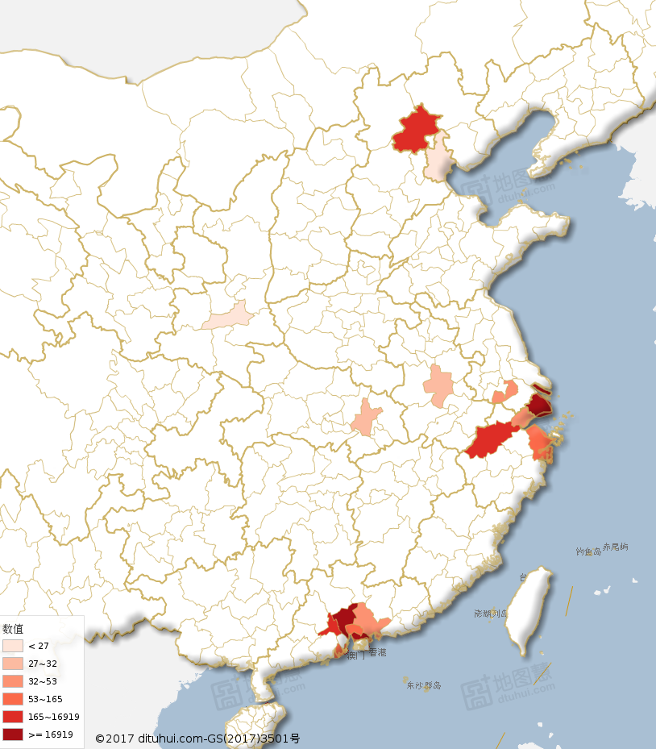
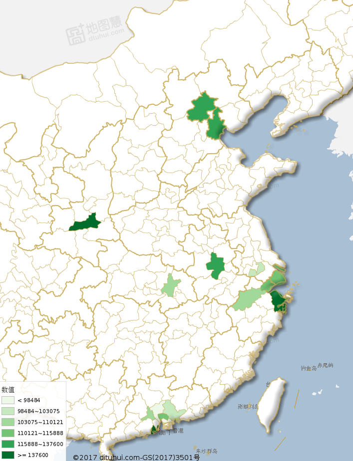
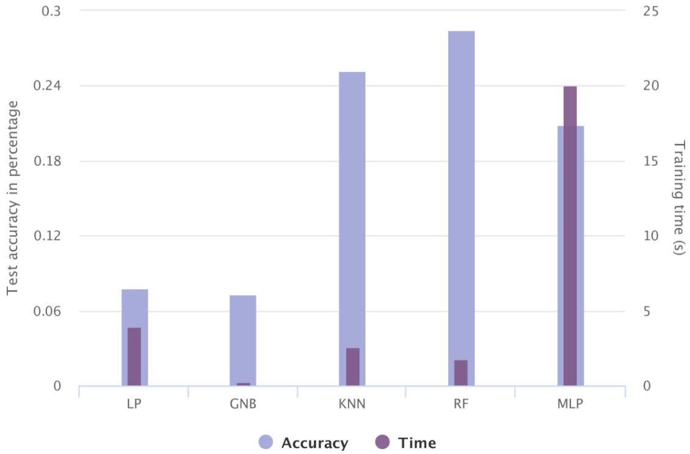

# Data-Mining-51Job
This repository is established to explore the data on [51Job website](https://www.51job.com/), where a number of companies post their wanted positions, and at the same time employees could share their own profiles to boost their career development. Overall, the work in this repo could be summarized in following aspects: 

- Collect the job information using python crawler. 
- Preprocess the data (clean, discretize, match, normalize, etc).
- Conduct feature engineering to analyse the data.
- Design two tasks for real scenarios (salary and job type prediction).
- Apply various machine learning algorithms to our tasks.

The documents of our work are available here: [[report]](https://github.com/wangjksjtu/Data-Mining-51Job/blob/master/docs/report.pdf), [[notebook]](https://github.com/wangjksjtu/Data-Mining-51Job/blob/master/feature_analysis/feature_analysis.ipynb).

## Requirements
- [scrapy](https://scrapy.org/) (web crawling)
- [numpy](http://www.numpy.org/) and [pandas](http://pandas.pydata.org/) (data preprocessing)
- [scikit-learn](http://scikit-learn.org/stable/index.html) (ML-algorithms)
- [matplotlib](https://matplotlib.org/) and [seaborn](https://seaborn.pydata.org/index.html) (data visualization)

## QuickStart
### Web Crawling
We use [scrapy](https://scrapy.org/) to crawl raw data from [51Job website](https://www.51job.com/). See the directory ```/job51spider``` for codes. XPath is used to parse the html and extract data information.

After entering the directory, input the command in cmd.exe to run the spider.
```
scrapy crawl 51job
```
### Data Preprocessing
We use python libraries [pandas](http://pandas.pydata.org/) (using class dataframe) and re to preprocess the raw data. See /preprocess/preprocess.py for code.
You can find the preprocessed data in /data, where middleData.csv is the preprocessed data suitable for drawing pics,
 while quantityData.csv quantifies all data and fits further data analysis.

### Feature Engineering

See directory ```/pics```.
 We analyzed feature coorelation and feature distribution respectively. We found two some main features which affect salary level: education level requirements, work experience requirements and area location.

 


### Salary Prediction

| Model | R2 value | Mean Error ￥/year | time / s |  
| :---- |:------------:| :----: | :----: |
| Ada-Boost | 0.2350 | 37483.9 | 0.79 |
| Grad-Boost | __0.3237__ | __34031.4__ | 3.13 |
| SVR (RBF) | 0.0092 | 43301.9 | 350.08 |
| Bayesian Ridge | 0.2667 | 34031.4 | 0.05 |
| Elastic Net | 0.0426 | 44784.4 | __0.03__ |
| MLPs | 0.2682 | 36207.3 | 19.29 |


### Job Area Prediction

| Model | Accuracy / % | time / s | Model | Accuracy / % | time / s |  
| :---- |:------------:| :----: | :---- |:------------:| :----: |
| LP | 7.79% | 3.89 | MLP | 20.91% | 20.05 | 
| GNB | 7.32% | __0.23__ | SVM | __29.31%__ | 1032.75 |
| KNN | 25.19% | 2.60 | XGBoost | 27.53%  | 303.21 |
| RF | 28.44% | 1.80 | 


The accuracy & time plot of the above models:
<figure class="half">
    
</figure>


## Team Members
- [Jingkang Wang](https://github.com/wangjksjtu)
- [Jilai Zheng](https://github.com/zhengjilai)
- [Qingzhao Zhang](https://github.com/zqzqz)
- [Lei Wang](https://github.com/Dulou)
- [Jinrui Sha](https://github.com/sjrGCkym)
- [Zhongwei Chen]()

